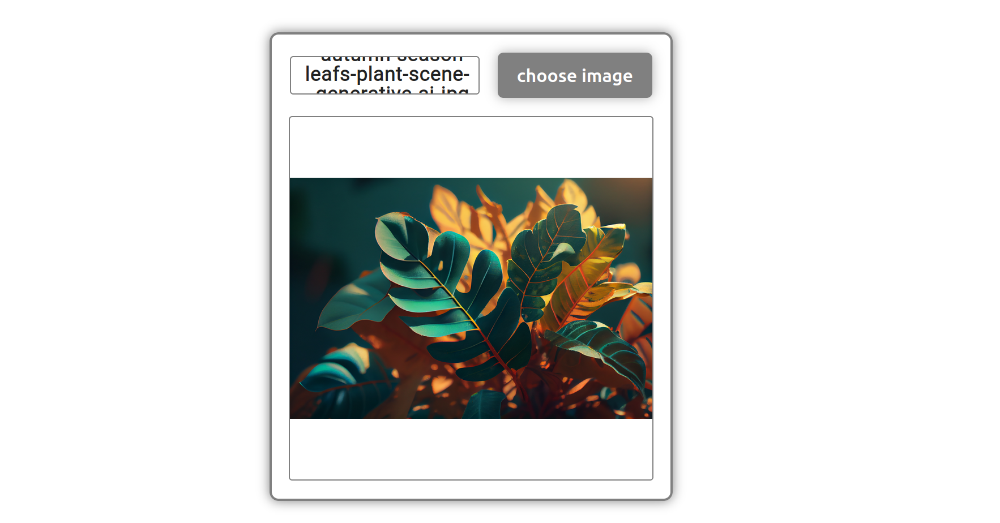

# Image Display Handler




## Description

This JavaScript file (`main.js`) provides functionality for handling image selection and display within an HTML document. It includes event listeners for a button click, triggering a file input, and dynamically updating the UI to display the selected image.

## Table of Contents

- [Usage](#usage)
- [Functionality](#functionality)
- [License](#license)

## Usage

You can include this script in your project by copying the imageDisplayHandler.js file into your project directory.

1. Include the `main.js` file in your HTML document:

   ```html
   <script src="./js/main.js"></script>
   
2.Customize the styles and adapt the code as needed for your project.
 
 
 ## Functionality

    Clicking the "Choose Image" button opens the file selection dialog.
    Upon selecting an image file, the UI is updated to display the image along with its name.
    The image dimensions are adjusted to maintain the correct aspect ratio.

## License 
  
Feel free to copy and use this version as needed.


